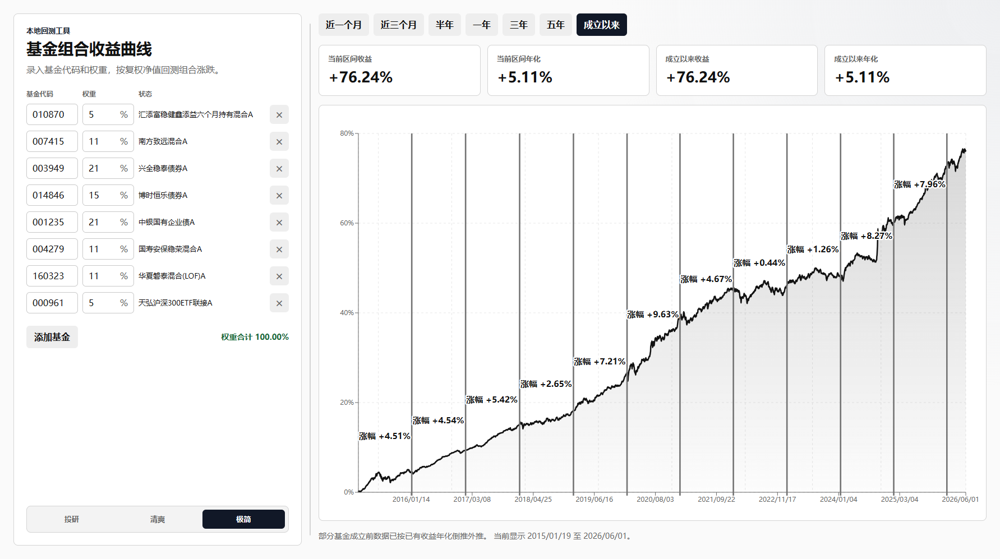

# 基金组合回测工具

一个本地运行的基金组合收益回测 Web 应用。输入基金代码和组合权重后，应用会联网获取基金历史复权净值，计算组合涨跌收益曲线，并展示当前区间收益、当前区间年化、成立以来收益和成立以来年化。

## 界面预览



## 功能特性

- 手动添加基金代码和百分比权重，权重合计需要等于 `100%`
- 自动获取基金历史复权净值，不额外扣除申购费、赎回费
- 图表展示组合总收益涨跌曲线，不展示年化收益曲线
- 支持区间切换：近一个月、近三个月、半年、一年、三年、五年、成立以来
- 按所选区间展示每段整年的涨跌幅，口径是区间涨跌幅，不是年化收益
- 多只基金历史长度不同时，回测按最长历史区间展示，短历史基金会按已有收益年化倒推外推
- 左右区域支持拖动调整宽度
- 支持保存最多 10 个基金组合，并可一键切换、重命名和删除
- 使用浏览器本地存储保存组合、主题和布局宽度
- 支持四套主题：投研、网易云、Mac、艾泽拉斯

## 运行环境

- Node.js 24 或更高版本
- npm

## 安装与启动

```bash
npm install
npm start
```

启动后，服务会自动在 `50000-60000` 范围内寻找可用端口，并在终端输出访问地址，例如：

```text
基金组合回测网站已启动: http://127.0.0.1:50000
```

打开该地址即可使用。

## 构建检查

```bash
npm run check
```

该命令会执行 TypeScript 类型检查和生产构建。

## 收益计算口径

- 使用复权净值计算收益
- 组合采用“初始权重买入后持有”，不做定期再平衡
- 组合收益曲线展示的是涨跌收益百分比，即 `组合收益倍率 - 1`
- 当前区间年化收益跟随用户选择的时间范围
- 成立以来年化收益始终使用组合最长历史起点至最新数据日
- 年化收益使用复利外推：

```text
(1 + 区间总收益) ^ (365 / 实际天数) - 1
```

## 历史长度不同的处理

当组合内基金历史数据长度不一致时，回测会按照所有基金中最早可用数据日期展示。短历史基金在真实成立日前的缺失数据，会使用该基金已有数据计算出的成立以来年化收益进行平滑倒推外推。

页面会在图表下方提示：

```text
部分基金成立前数据已按已有收益年化倒推外推。
```

## 数据来源

应用通过本地后端代理获取东方财富基金历史净值数据，并解析累计净值或复权净值序列。

注意：如果第三方数据接口结构变化，后端解析逻辑可能需要调整。

## 项目结构

```text
.
├── server/
│   └── index.mjs        # 本地 Express 服务和基金数据代理
├── src/
│   ├── main.tsx         # 前端界面、回测计算和图表
│   └── styles.css       # 页面布局和主题样式
├── docs/
│   └── screenshot.png   # README 界面截图
├── index.html
├── package.json
├── tsconfig.json
└── vite.config.ts
```

## 技术栈

- React
- TypeScript
- Vite
- Express
- Recharts

## 免责声明

本项目仅用于本地学习、研究和回测分析，不构成任何投资建议。基金历史收益不代表未来表现，请自行判断投资风险。
